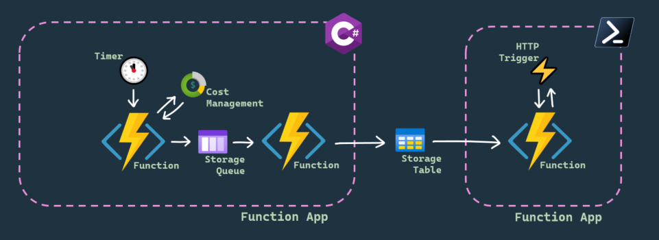

# Global Azure Stockholm 2023

This is the repo for my presentation "Get your func on with Azure Functions" at [Global Azure Stockholm 2023](https://www.meetup.com/vasteras-azure-user-group/events/291645252/), including slides and demo code, as well as a template to deploy the same app to your own environment to try it yourself.

## Azure Function Demo - CostReport App

The demo reads cost data for its own resource group and posts it to a table, which a client can request data from. The demo code consists of two function apps, one in C# and one in PowerShell.

### C\#

The C# function app has a system-assigned managed identity and two functions that it uses to make requests to the Cost Management API. The identity needs read access to cost data for the resource group scope. This is included in the template in this repo.

#### GetCostData

Triggered daily using a Timer trigger, gets pre-tax cost data from the previous day, and outputs it to a storage queue.

#### ProcessCostData

Triggered when a new message is posted to a storage queue, and posts the formatted message to a storage table.

### PowerShell

The PowerShell function app contains logic for a client to get the stored cost report data from the storage table.

#### CostReport

Triggered by a HTTP GET request, returns the cost report data from the storage table as JSON.

## Tooling and Links

- [Azure Functions Documentation](https://learn.microsoft.com/en-us/azure/azure-functions/)
- [Visual Studio Code](https://aka.ms/vscode)
- [Azure Functions - Extension for Visual Studio Code](https://marketplace.visualstudio.com/items?itemName=ms-azuretools.vscode-azurefunctions)
- [Azurite (Local Azure Storage Emulator) - Extension for Visual Studio Code](https://marketplace.visualstudio.com/items?itemName=Azurite.azurite)
- [Bicep - Extension for Visual Studio Code](https://marketplace.visualstudio.com/items?itemName=ms-azuretools.vscode-bicep)
- [Azure Functions Core Tools CLI (Comes with VSCode Extension)](https://learn.microsoft.com/en-us/azure/azure-functions/functions-run-local)
- [PowerShell](https://github.com/PowerShell/PowerShell)
